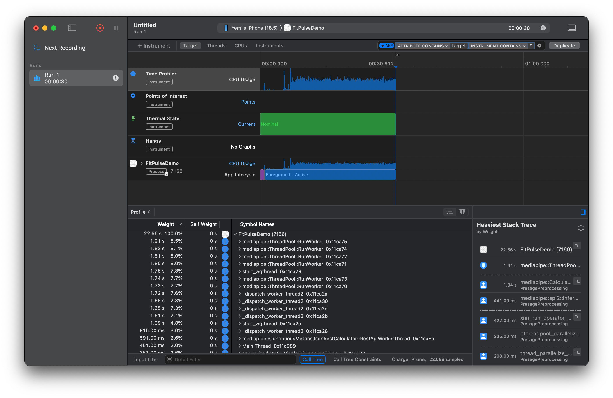

# ❤️ FitPulseDemo
**FitPulseDemo** is a lightweight SwiftUI demo that uses the SmartSpectraSwiftSDK to detect and visualize real-time heart rate data from the iPhone camera. It demonstrates camera permission handling, live BPM updates, and heart rate statistics (min/max/avg) with responsive SwiftUI components.


---

## Features
 - Real-time heart rate monitoring using `SmartSpectraSwiftSDK`
 - SwiftUI interface with animated pulse indicator
 - Displays live BPM + historical Min, Max, Avg stats
 - Start/Stop toggle for monitoring
 - Light/Dark mode support
 - Unit tested using Swift Testing
 - Uses Charts framework to show BPM history

 ---

## Quick Start
Refer to [`QuickStart.md`](./QuickStart.md) for:
  - Step-by-step setup & import guide
  - Code snippets to get up and running
  - Privacy settings for camera access
  - How to request your `SmartSpectra` API key

  --- 

## Performance Optimization
### Optimization Opportunity

Currently, the app processes every frame (~30 FPS), which creates heavy CPU usage on some devices. From profiling (see Instruments screenshot above), most CPU loads stems from continuous frame processing by `MediaPipe`.

**Planned Optimization:** 
Throttle the processing rate by **skipping frames**, e.g. analyzing only 1 in every 3 frames. This reduces CPU load without significantly affecting BPM accuracy.

**Psuedocode:**
```swift
if frameCount % 3 == 0 {
    processFrame(frame)
}

frameCount += 1
```

## Time Profile Screenshot
<p align="center">
    
</p>

---

## Additional Features
###  📈 Real-Time BPM Chart
- Smooth, continuous chart using Swift Charts
- Auto-updates with each new BPM reading
- Respects light and dark mode for seamless appearance


### How it works
- The `HeartRateMonitorViewModel` maintains a `bpmHistoryData` array that stores time-stamped BPM readings.
- In `HeartRateView.swift`, we use Swift Charts to render a `LineMark`


### 🧩 Notes:

- The chart is wrapped in a card-style container using RoundedRectangle for a cleaner visual grouping.
- Axes are hidden for simplicity, but can be toggled if needed.  
- Uses adaptive system colors for full light/dark mode support.

---
## Documentation
- [`QuickStart.md`](./docs/QuickStart.md) - Setup steps and troubleshooting
- [`FAQ.md`](./docs/FAQ.md) - Answers to common questions

